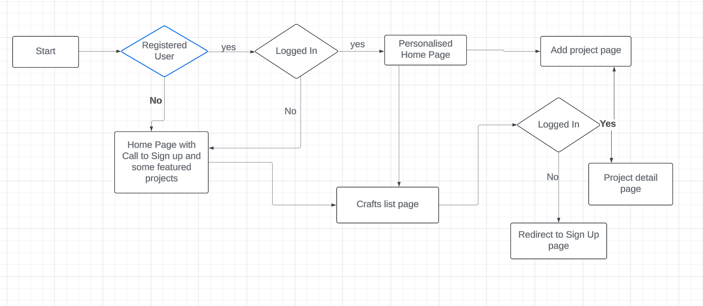
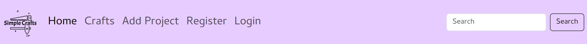
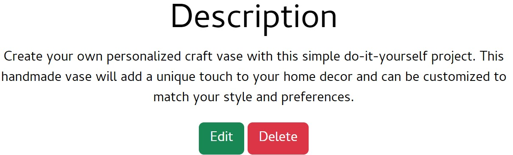

# Simple Crafts

Simple Crafts is a site that provides a collection of craft ideas in a variety of categories. 
These will be regularly updated by members of the site, who can share their expertise and passion for crafts and regularly return for more ideas.

The site will feature all the information needed to craft the featured projects, and it will be provided in a simple and easy to digest manner. The site aims to eventually build a community for those who love arts and crafts. 

[Link to deployed site](https://simple-crafts-b645ce9ac856.herokuapp.com/)

# UX

The website is mainly geared towards adults who would like to carry out some diy craft projects, however a 'kids' category is also included in the modedls so that parents can also carry out fun activities with their children.

The aim of the website is to allow easy and intuitive navigation for a streamlined experience.
All users can access the bank of projects that have been uploaded and the most liked are featured on the homepage to entice those that are not registered to sign up.

Users who are logged in can access the full details and instructions of individual projects and also like and unlike them. They can also upload their own projects to share with the community and edit and delete their entries. This allows users to store their craft ideas and access them at any time. 

**User Stories**

The User stories were split in to different Epics to group together user stories with a similar underlying theme

### Epic : Admin

 As a **site admin** I can **access the admin panel** so that **I can manage site content**

- Acceptance criteria 1: admin can create superuser account

- Acceptance criteria 2: admin can create posts

- Acceptance criteria 3: admin can edit and delete posts

 As a **site admin** I can **log out** so that **I am able to disconnect from the website**

- Acceptance criteria 1: logout functionality for admin users

### Epic : Navigation

As a **user** I can **view craft projects** so that **I can get ideas on what to create**

- Acceptance criteria 1: craft project ideas are displayed to users

- Acceptance criteria 2: project detail page is displayed to users

As a **site user** I can **easily navigate the website** so that **I can find the correct page/content easily**

- Acceptance criteria 1: well structured navbar

- Acceptance criteria 2: navigation links all work when clicked

- Acceptance criteria 3: navigation links lead to the correct place

As a **user** I can **experience a responsive design** so that **I can use the website across a range of different sized devices**

- Acceptance criteria 1: website scales well across different screen sizes

- Acceptance criteria 2: layout of content changes relevant to screen size

- Acceptance criteria 3: font is easily readable on smaller devices

As a **user** I can **search using keywords** so that **I can find specific crafts posts easily**

- Acceptance criteria 1: search bar available

- Acceptance criteria 2: variety of searchable parameters

As a **User** I can **see how many times a post has been liked** so that **I can tell which projects are popular**

- Acceptance criteria 1: There is a like counter

- Acceptance criteria 2 : Users are able to see the number of likes displayed with projects

### Epic: Account

As a **user** I can **register an account** so that **I can interact further with the website**

- Acceptance criteria 1: user can create an account

- Acceptance criteria 2: user can login

- Acceptance criteria 3: user can logout

As a **registered user** I can **log in and log out of my account** so that **I can easily connect to or disconnect from the website**

- Acceptance criteria 1 : User can register an account

- Acceptance criteria 2 : User can log in

- Acceptance criteria 3: User can log out

### Epic: Site Interactivity

As a **logged in user** I can **add craft projects** so that **they are available on the website**

- Acceptance criteria 1: user can log in

- Acceptance criteria 2: user can add posts to the website as craft projects

As a **logged in user** I can **upload images to my projects** so that **the final result of craft project is visible**

- Acceptance criteria 1: image upload available through front end form

As a **logged in user** I can **edit the projects that I have added** so that **I can make changes/rectify any mistakes**

- Acceptance criteria 1: logged in user can access their projects

- Acceptance criteria 2: logged in user can edit their projects

As a **logged in user** I can **delete my added projects** so that **I can control the content I upload**

- Acceptance criteria 1: logged in user can access their own projects

- Acceptance criteria 2: logged in user can delete their own projects

As a **logged in user** I can **favourite a project** so that **I can easily reference craft projects that I found whilst browsing**

- Acceptance criteria 1: create an add to favourites button

- Acceptance criteria 2: be able to click add to favourites button

- Acceptance criteria 3: be able to unlick add to favourites button

As a **logged in user** I can **like and unlike projects** so that **I can show my appreciation for projects**

- Acceptance criteria 1 : Logged in User can access 'like' button

- Acceptance criteria 2: User can click like button to like and unlike projects

- Acceptance criteria 3: Like button colour is updated for feedback

# Design

## Wireframes

Balsamiq was used to create wireframes for the initial design, they are available below:

Desktop Homepage

Mobile and Tablet Homepage

Desktop Project List Page

Mobile and Tablet Project List Page

Desktop Full Project Page

Mobile and Tablet Full Project Page

## Colour Scheme

I used WebAIM contrast checker (https://webaim.org/) to ensure the colour scheme was suitable.

## Typography

The Cambay font was selected and used in a range of weights, as it has an elegant modern aesthetic whilst still maintaining good readability. 

# Agile

The Agile methodology was used for planning and creation of this website. I set up a project kanban board using Github projects. The MoSCoW method was used to help prioritise features with a view to achieve MVP initially and then build further if possible. 

# Database Design

I used Lucidchart to create an Entity Relationship Diagram to help me plan the fields for my database models and understand how the models would link together

### Data Models

I used the built in Django user model and created custom Project and Category models.

### Flow Chart

I used Lucidchart to create a logic flowchart to help me visualise how to control access to different pages with user authentication and also to help me priotise features.

### Existing Features

**Navigation Bar**

The navbar features on all pages for consistency and includes links to the Logo, Home page, Craft list page and Add Craft page. The Account pages differ depending on if the user is logged in or not. On smaller devices such as tablets and mobiles, it becomes a dropdown menu utilising the burger icon for better responsivity.

Desktop Navbar   

Toggle Navbar

Logged In User Navbar

When a user is logged in, the Navbar shows logout instead of login/register

**Homepage**

The Homepage has a large background image of craft materials in a Jumbotron with the website logo and a sign up button as call to action for unregistered users.

It also features 3 of the most liked projects to give potential site members a preview of what to expect fron the website. The featured projects are in the form of images with an overlay of the title of the project and the number of likes it has recieved

If a user clicks on the image they are redirected to the sign in page which includes a link to register if they dont have an account

For logged in users the homepage features different content, the slogan is changed to a welcome message and they are prompted to add new projects.

**The Footer**

The footer featurss on all pages and includes links to the relevant social media sites for Simply Crafts and also a link to my github. The links will open to a new tab to allow easy navigation for the user. It is responsive across different devices.

**Crafts page**

This page features the craft projects that have already been added to the website. They are arranged on cards, which have a feature image, number of likes, author, publish date and a large call to action button that features the title. Non registered users are able to browse this section in order to pique their interest and entice them to register. If they click on the titles then they will be redirected to the login page.

**Full Project Page**

When users click on the black title button on the Crafts page, they will be taken to the full project page if logged in.

Here they can see the full information for the project, including an image, description, materials and step by step instructions. They can also like or unlike the project this page.

If it is a project they have uploaded then they can also edit or delete the project. 

**Like button**

On the full project page, logged in users can like or unlike a project, they will know they have liked it as the counter underneath will increase and the icon will go from white to solid

**Like button when unliked**

**Like button after liking a project**

**Edit and Delete buttons**

These buttons are only visible to the user who has uploaded this particular project and to any admin user as they will have superuser priveleges.

If users click delete they are first taken to a screen that allows them to confirm they wish to delete the project before that action is completed, this can help avoid accidental deletions.

**The Sign in Page**

Registered users can sign in here, this is also a page where non logged in users will be redirected to if they try and access a page that requires authentication.

There is also a link for users to reach the registration page if they dont have an account

**Registration Page**

New users can register here, and there is a link for already registered users to access the login page from here.

**Add Project Page**

This page is only accessible by logged in users and here they can fill in a form to have their project added to the site

**Success Messages**

Users are shown success messages at the top of the screen to confirm that they have registered, signed in, added a project, edited/updated a project or deleted a project.

**Customised 404 and 403 error pages**

For a better user experience, if a user ends up at an invalid page they are taken to a 404 error page from where they can click a button to return to the homepage

Although the edit and delete buttons are hidden from users who are not admin or authors of the post, they could try and access via the address bar, they will be directed to the 403 forbidden page from where they can return to homepage

**Search Bar**

Users are able to search using keywords featured in the title, description or category of the project so they can find the type of craft projects they are looking for more quickly, rather than having to browse through every entry.

### Features Left to Implement

A personalised homepage specific to the user who has logged in, where they can view the projects they have personally uploaded

A "liked projects" page where logged in users can bookmark the projects they have liked and found interesting

Possibly also the ability to leave comments under projects

## Technologies Used

Balsamiq - to create site wireframes.

Lucidcharts - to create ERD and flow chart

Git used for version control

GitHub - Holds the repository of my project, GitHub connects to GitPod and Heroku.

GitPod – Connected to GitHub, GitPod hosted the coding space, allowing the project to be built and then committed to the GitHub repository.

Heroku - Connected to the GitHub repository, Heroku is a cloud application platform used to deploy this project so the backend language can be utilised/tested.

Django - This framework was used to build the foundations of this project

Gunicorn - Gunicorn is a pure-Python HTTP server for WSGI applications.

Bootstrap - used for styling the website.

Cloudinary - Used to host images.

Google Fonts - provide fonts for the website.

Font Awesome - was used for icons.

Am I Responsive - to check if the site is responsive on different screen sizes.

W3C Markup Validator - used to validate HTML

W3C CSS Validator - used to validate CSS

Code Institute python linter - used to validate python code

## Testing 

[Link to Testing document](testing.md)

## Deployment

### Github

To create a new repository I took the following steps:

Ensured I was logged in to Github
Navigated to the Code institute template page
Clicked "Use this templated"
Create new repository which I named
Then I opened the repository in a Gitpod workspace for editing

### Django and Heroku

I followed the instructions on the Code Institute Django Deployment Instructions 2024 to set up Django and deploy to Heroku 

The live link can be found here - https://code-institute-org.github.io/love-running-2.0/index.html 

## Credits 

Footer from : https://mdbootstrap.com/docs/standard/extended/social-media-icons-footer/#, under free licence

This series of Youtube videos by Daisy MC was used for the general structure of the code and views etc:

https://www.youtube.com/watch?v=sBjbty691eI&list=PLXuTq6OsqZjbCSfiLNb2f1FOs8viArjWy

This youtube video by Code with Clinton was used to help with creation of the likes functionality:

https://www.youtube.com/watch?v=ZUiTiUj-tZw

This forum post was very helpful in use of UUID for slug generation:

https://forum.djangoproject.com/t/how-to-ensure-that-uuid-slug-will-be-always-unique/3484

I think therefore I blog walkthrough on LMS was used to help with html structure

The code for hero image and overlay was inspired by this project:

https://github.com/rachbry/recipme-django-cookbook/tree/main

All images were generated by Bing AI image generator:

https://www.bing.com/images/create

All project instructions etc were designed by Chat GPT, which also helped with some debugging and general queries

The logo was created for free on this website:

https://logo.com/

