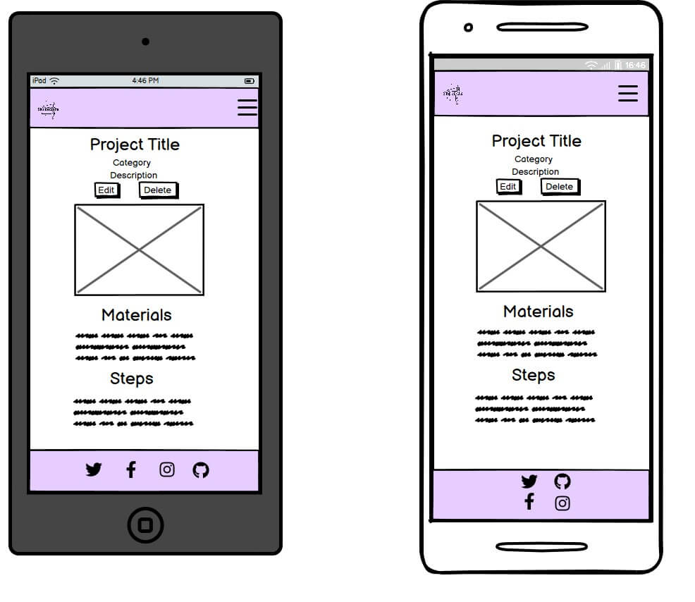

# Simple Crafts

Simple Crafts is a site that provides a collection of craft ideas in a variety of categories. 
These will be regularly updated by members of the site, who can share their expertise and passion for crafts and regularly return for more ideas.

The site will feature all the information needed to craft the featured projects, and it will be provided in a simple and easy to digest manner. The site aims to eventually build a community for those who love arts and crafts. 

# UX

The website is mainly geared towards adults who would like to carry out some diy craft projects, however a 'kids' category is also included in the modedls so that parents can also carry out fun activities with their children.

The aim of the website is to allow easy and intuitive navigation for a streamlined experience.
All users can access the bank of projects that have been uploaded and the most liked are featured on the homepage to entice those that are not registered to sign up.

Users who are logged in can access the full details and instructions of individual projects and also like and unlike them. They can also upload their own projects to share with the community and edit and delete their entries. This allows users to store their craft ideas and access them at any time. 

**User Stories**

1. As a **site admin** I can **access the admin panel** so that **I can manage site content**

- Acceptance criteria 1: admin can create superuser account

- Acceptance criteria 2: admin can create posts

- Acceptance criteria 3: admin can edit and delete posts

2. As a **site admin** I can **log out** so that **I am able to disconnect from the website**

- Acceptance criteria 1: logout functionality for admin users

3. As a **user** I can **view craft projects** so that **I can get ideas on what to create**

- Acceptance criteria 1: craft project ideas are displayed to users

- Acceptance criteria 2: project detail page is displayed to users

4. As a **user** I can **register an account** so that **I can interact further with the website**

- Acceptance criteria 1: user can create an account

- Acceptance criteria 2: user can login

- Acceptance criteria 3: user can logout

5. As a **logged in user** I can **add craft projects** so that **they are available on the website**

- Acceptance criteria 1: user can log in

- Acceptance criteria 2: user can add posts to the website as craft projects

6. As a **logged in user** I can **upload images to my projects** so that **the final result of craft project is visible**

- Acceptance criteria 1: image upload available through front end form

7. As a **logged in user** I can **edit the projects that I have added** so that **I can make changes/rectify any mistakes**

- Acceptance criteria 1: logged in user can access their projects

- Acceptance criteria 2: logged in user can edit their projects

8. As a **logged in user** I can **delete my added projects** so that **I can control the content I upload**

- Acceptance criteria 1: logged in user can access their own projects

- Acceptance criteria 2: logged in user can delete their own projects

9. As a **site user** I can **easily navigate the website** so that **I can find the correct page/content easily**

- Acceptance criteria 1: well structured navbar

- Acceptance criteria 2: navigation links all work when clicked

- Acceptance criteria 3: navigation links lead to the correct place

10. As a **user** I can **experience a responsive design** so that **I can use the website across a range of different sized devices**

- Acceptance criteria 1: website scales well across different screen sizes

- Acceptance criteria 2: layout of content changes relevant to screen size

- Acceptance criteria 3: font is easily readable on smaller devices

11. As a **user** I can **search using keywords** so that **I can find specific crafts posts easily**

- Acceptance criteria 1: search bar available

- Acceptance criteria 2: variety of searchable parameters

12. As a **logged in user** I can **favourite a project** so that **I can easily reference craft projects that I found whilst browsing**

- Acceptance criteria 1: create an add to favourites button

- Acceptance criteria 2: be able to click add to favourites button

- Acceptance criteria 3: be able to unlick add to favourites button

13. As a **logged in user** I can **like and unlike projectss** so that **I can show my appreciation for projects**

- Acceptance criteria 1 : Logged in User can access 'like' button

- Acceptance criteria 2: User can click like button to like and unlike projects

- Acceptance criteria 3: Like button colour is updated for feedback

14. As a registered user I can **log in and log out of my account** so that **I can easily connect to or disconnect from the website**

- Acceptance criteria 1 : User can register an account

- Acceptance criteria 2 : User can log in

- Acceptance criteria 3: User can log out

15. As a **User** I can **see how many time**s a post has been liked** so that **I can tell which projects are popular**

- Acceptance criteria 1: There is a like counter

- Acceptance criteria 2 : Users are able to see the number of likes displayed with projects

# Wireframes

Desktop Homepage

Mobile and Tablet Homepage

Desktop Project List Page

Mobile and Tablet Project List Page

Desktop Full Project Page

Mobile and Tablet Full Project Page

# Database ERD

### Existing Features

- __Navigation Bar__

  - Featured on all three pages, the full responsive navigation bar includes links to the Logo, Home page, Gallery and Sign Up page and is identical in each page to allow for easy navigation.
  - This section will allow the user to easily navigate from page to page across all devices without having to revert back to the previous page via the ‘back’ button. 

- __The landing page image__

  - The landing includes a photograph with text overlay to allow the user to see exactly which location this site would be applicable to. 
  - This section introduces the user to Love Running with an eye catching animation to grab their attention

- __The Footer__ 

  - The footer section includes links to the relevant social media sites for Love Running. The links will open to a new tab to allow easy navigation for the user. 
  - The footer is valuable to the user as it encourages them to keep connected via social media

- __Gallery__

  - The gallery will provide the user with supporting images to see what the meet ups look like. 
  - This section is valuable to the user as they will be able to easily identify the types of events the organisation puts together. 

- __The Sign Up Page__

  - This page will allow the user to get signed up to Love Running to start their running journey with the community. The user will be able specify if they would like to take part in road, trail or both types of running. The user will be asked to submit their full name and email address. 

For some/all of your features, you may choose to reference the specific project files that implement them.

In addition, you may also use this section to discuss plans for additional features to be implemented in the future:

### Features Left to Implement

- Another feature idea

## Testing 

In this section, you need to convince the assessor that you have conducted enough testing to legitimately believe that the site works well. Essentially, in this part you will want to go over all of your project’s features and ensure that they all work as intended, with the project providing an easy and straightforward way for the users to achieve their goals.

In addition, you should mention in this section how your project looks and works on different browsers and screen sizes.

You should also mention in this section any interesting bugs or problems you discovered during your testing, even if you haven't addressed them yet.

If this section grows too long, you may want to split it off into a separate file and link to it from here.

### Validator Testing 

- HTML
  - No errors were returned when passing through the official [W3C validator](https://validator.w3.org/nu/?doc=https%3A%2F%2Fcode-institute-org.github.io%2Flove-running-2.0%2Findex.html)
- CSS
  - No errors were found when passing through the official [(Jigsaw) validator](https://jigsaw.w3.org/css-validator/validator?uri=https%3A%2F%2Fvalidator.w3.org%2Fnu%2F%3Fdoc%3Dhttps%253A%252F%252Fcode-institute-org.github.io%252Flove-running-2.0%252Findex.html&profile=css3svg&usermedium=all&warning=1&vextwarning=&lang=en#css)

### Unfixed Bugs

You will need to mention unfixed bugs and why they were not fixed. This section should include shortcomings of the frameworks or technologies used. Although time can be a big variable to consider, paucity of time and difficulty understanding implementation is not a valid reason to leave bugs unfixed. 

## Deployment

This section should describe the process you went through to deploy the project to a hosting platform (e.g. GitHub) 

- The site was deployed to GitHub pages. The steps to deploy are as follows: 
  - In the GitHub repository, navigate to the Settings tab 
  - From the source section drop-down menu, select the Master Branch
  - Once the master branch has been selected, the page will be automatically refreshed with a detailed ribbon display to indicate the successful deployment. 

The live link can be found here - https://code-institute-org.github.io/love-running-2.0/index.html 

## Credits 

footer from : https://mdbootstrap.com/docs/standard/extended/social-media-icons-footer/#, under free licence

### Content 

- The text for the Home page was taken from Wikipedia Article A
- Instructions on how to implement form validation on the Sign Up page was taken from [Specific YouTube Tutorial](https://www.youtube.com/)
- The icons in the footer were taken from [Font Awesome](https://fontawesome.com/)

### Media

- The photos used on the home and sign up page are from This Open Source site
- The images used for the gallery page were taken from this other open source site

Congratulations on completing your Readme, you have made another big stride in the direction of being a developer! 

## Other General Project Advice

Below you will find a couple of extra tips that may be helpful when completing your project. Remember that each of these projects will become part of your final portfolio so it’s important to allow enough time to showcase your best work! 

- One of the most basic elements of keeping a healthy commit history is with the commit message. When getting started with your project, read through [this article](https://chris.beams.io/posts/git-commit/) by Chris Beams on How to Write  a Git Commit Message 
  - Make sure to keep the messages in the imperative mood 

- When naming the files in your project directory, make sure to consider meaningful naming of files, point to specific names and sections of content.
  - For example, instead of naming an image used ‘image1.png’ consider naming it ‘landing_page_img.png’. This will ensure that there are clear file paths kept. 

- Do some extra research on good and bad coding practices, there are a handful of useful articles to read, consider reviewing the following list when getting started:
  - [Writing Your Best Code](https://learn.shayhowe.com/html-css/writing-your-best-code/)
  - [HTML & CSS Coding Best Practices](https://medium.com/@inceptiondj.info/html-css-coding-best-practice-fadb9870a00f)
  - [Google HTML/CSS Style Guide](https://google.github.io/styleguide/htmlcssguide.html#General)

Getting started with your Portfolio Projects can be daunting, planning your project can make it a lot easier to tackle, take small steps to reach the final outcome and enjoy the process! 