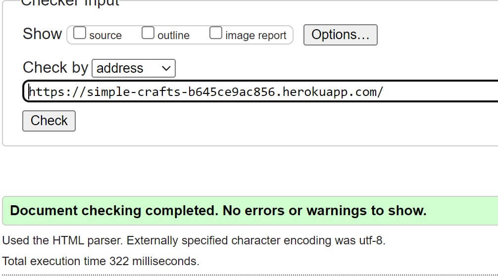
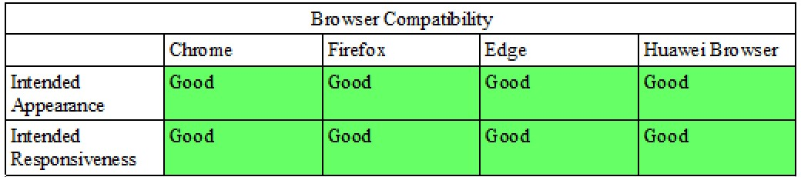

# Validation Testing

## HTML

W3 validator used to check for html errors https://validator.w3.org/nu/

|Page | Link|Screenshot |Result|
|:----------:|:----------:|:----------:|:----------:|
| Home - not logged in|https://validator.w3.org/nu/?doc=https%3A%2F%2Fsimple-crafts-b645ce9ac856.herokuapp.com%2F ||No errors|
Home-logged in| https://validator.w3.org/nu/?doc=https%3A%2F%2Fsimple-crafts-b645ce9ac856.herokuapp.com%2F#textarea ||No errors|
Crafts Page| https://validator.w3.org/nu/?showsource=yes&doc=https%3A%2F%2Fsimple-crafts-b645ce9ac856.herokuapp.com%2Fprojects%2Fprojects%2F ||No errors|
Full Project Page - not logged in| https://validator.w3.org/nu/?showsource=yes&doc=https%3A%2F%2Fsimple-crafts-b645ce9ac856.herokuapp.com%2Fprojects%2Fbee-hotel%2F ||No errors|
Full Project Page - authenticated (edit/delete) - validation errors due to richtext input| https://validator.w3.org/nu/?showsource=yes&doc=https%3A%2F%2Fsimple-crafts-b645ce9ac856.herokuapp.com%2Fprojects%2Fbee-hotel%2F#textarea ||validation errors due to richtext input|
Add Project Page - logged in| checked via text input ||No errors|
Edit Project Page - logged in| checked via text input ||No errors|
Delete Project Page - logged in| Checked via text input||No errors|
Logout Page - logged in| Checked via text input||No errors|
Register| https://validator.w3.org/nu/?showsource=yes&doc=https%3A%2F%2Fsimple-crafts-b645ce9ac856.herokuapp.com%2Faccounts%2Fsignup%2F||No errors|
Login| https://validator.w3.org/nu/?showsource=yes&doc=https%3A%2F%2Fsimple-crafts-b645ce9ac856.herokuapp.com%2Faccounts%2Flogin%2F||No errors|
 
## CSS

W3 validator was also used for the CSS file, no issues were found as show in screenshot below

## Python

I used the CI Python Linter https://pep8ci.herokuapp.com/# on all my .py files. All now have no errors as seen below

| File      | Screenshot |
|-----------|------------|
|simple_crafts settings.py   |  |
| simple_crafts urls.py    |  |
| home urls.py    |  |
| home views.py    |  |
| projects admin.py    |  |
| projects forms.py    |  |
| projects models.py    |  |
| projects urls.py    |  |
| projects views.py    |  |

# Manual Testing

## User Story testing

| User Story      | Expected Outcome | Outcome  |
|-----------------|------------------|----------|
| As a **site admin** I can **access the admin panel** so that **I can manage site content**        | Admin can access admin panel and edit, delete and create | passed|
| As a **site admin** I can **log out** so that **I am able to disconnect from the website**       | Logout works for admin | passed |
| As a **user** I can **view craft projects** so that **I can get ideas on what to create**       | Users, whether logged in or not can click crafts page to view the available projects | passed |
| As a **user** I can **register an account** so that **I can interact further with the website**        | Register link opens registration form which can be filled out and submitted | passed |
| As a **logged in user** I can **add craft projects** so that **they are available on the website**       | Add Crafts links opens the Add craft form for logged in users but will redirect to login page if not logged in | passed |
| As a **logged in user** I can **upload images to my projects** so that **the final result of craft project is visible**        | Images can be uploaded via Add project form| passed |
| **logged in user** I can **edit the projects that I have added** so that **I can make changes/rectify any mistakes**      | If user has added the project, they can access edit project button which opens edit form | passed but issue with current image not being populated in form automatically|
|As a **logged in user** I can **delete my added projects** so that **I can control the content I upload**      | If the logged in user has added the project they can access delete button and use it to remove the project | passed |
| As a **site user** I can **easily navigate the website** so that **I can find the correct page/content easily**       | Users can use all navigation links they are authenticated for and navbar links work properly | passed |
| As a **user** I can **experience a responsive design** so that **I can use the website across a range of different sized devices**        | All pages are responsive across devices, checked in Chrome devtools and manually on a mobile | passed |
| As a **user** I can **search using keywords** so that **I can find specific crafts posts easily**       | Searchbar returns results| passed |
| As a **logged in user** I can **favourite a project** so that **I can easily reference craft projects that I found whilst browsing**|There will be a favourite button to use and add projects to users favourites |Failed - this idea was abandoned in favour of a "likes" functionality |
| As a **logged in user** I can **like and unlike projects** so that **I can show my appreciation for projects**        | Logged in users can access "likes" button and can be clicked to like and unlike a project | passed |
| As a registered user I can **log in and log out of my account** so that **I can easily connect to or disconnect from the website**      | When users use the login form, they are logged in to the website and when they click logout from navbar they are taken to logout page which logs them out from their account | passed |
| As a **User** I can **see how many times a post has been liked** so that **I can tell which projects are popular**       | Likes counter will display number of likes and will be updated when like button is clicked| passed |

## Other Manual Testing

| Feature  |  Expected Outcome | Outcome |
|--------|--------|------------------|
| Logo | Returns to Homepage when clicked | Passed|
| Sign up button on homepage| Opens sign up form | passed |
| Navbar Links |  All lead to relevant pages when clicked | passed |
| Footer links |  Relevant website opens in new page | passed |
| Authentication |  If non logged in users try to access a page where authentication is necessary they are redirected to sign in | passed |
| Like button |  Can be clicked to register a like and then clicked again to unlike | passed |
| Like counter |  Number increases with more likes | passed |
| Forms |  All forms can be submitted if valid information entered | passed |
| Edit Form | All currently saved information for the particular project should be automatically populated in the edit form so that it can be reviewed and changed as necessary | The current image field on the edit form is not populated automatically and I had to add code to the edit page html and views so that it can be manually retrieved |
| Project title buttons | Buttons featuring the project title on the crafts page lead to full project details if logged in or to sign in page if not | passed |
|Homepage images and project title buttons | These appear for non logged in users and lead to sign in form if clicked | passed |
| Success Messages | Success messages appear at top of screen after a user registers, logs in, adds a project, edits/updates a project or deletes a project | passed |
| 404 page | If user tries to access an invalid page that doesnt exist they are redirected to 404 error page and from here they can click a button to return to home screen | passed |
| 403 page | If user tries to perform an action or reach an area they are not authorised for, such as editing or deleting a project they are not the author of, they are redirected to the 403 error page and from here they can click a button to return to home screen | passed |
 

# Responsivity Testing

Responsivity was tested using Chrome devtools to ensure all pages of the website scaled well across all emulated device sizes, including Iphone SE, XR, 12 Pro, 14 Pro Max, Google Pixel 7, Samsung Galaxy S20 Ultra and S8+, Samsung Galaxy A51/A71 Fold, ipad Mini, Air, Pro, Surface Pro 7, Surface Duo,Asus Zenbook Fold, Nest Hub, Nest Hub Max. Some gifs are included below where screen was recorded whilst widening and narrowing the devtools windows

Please note that the files have been compressed but there may still be slow loading 

I checked desktop versions of Chrome, Microsoft Edge and Mozilla firefox manually, and also Chrome and Huawei native broswer on a Huawei P30 Pro mobile phone, all pages looked fine and buttons and links worked as they should. I did not have access to any Apple devices to check Safari.

Initially there was an issue with how text was being rendered over the homepage images on firefox so the styling was changed and now the homepage renders properly on all browsers

## Lighthouse

Lighthouse testing was performed in Chrome devtools

Mobile results:

**Homepage**

**Crafts Page**

**Full Project**

**Add Project**

Desktop Results:

**Homepage**

**Crafts Page**

**Full Project**

**Add Project**

# Bugs

**Text-overflow error**

If a user was to extend their text right to the end of the add or edit project form fields, this was causing text to extend outside the boundary of its container on the full project page.

![Add form bug] (assets/test-images/bug-add-project.png)

![Uncontained text] (assets/test-images/bug-demo.jpg)

This was fixed by using word-wrap: break-word; in CSS to ensure that words would wrap to the next line when reaching end of container. 

**Edit Form Bug**

The edit form is formatted with crispy forms and a class based UpdateView is used with it. All current information of the project populates the form automatically apart from the current image field and this remains blank.

The current image field shows the current image name in the admin panel but not on the front end, I was not able to fix this but a workaround was to manually retrieve the current image and add it to the bottom of the form.

**Integrity Error**

Initially I had the project model title set to be unique as I assumed this would ensure slugs generated from the title would also be unique. However I realised that the front end add project form was case sensitive e.g if a project titled Test already existed then it would still allow submission of test, which would then cause an integrity error with identical slug, as slug field was also set to unqiue in the model and this was necessary as slug is being used for url generation.

To overcome this I changed the slug to be generated using UUID instead of title to ensure uniqueness. This also allowed me to remove unique=True from the title field in the model so different users can post a project with the same title as they may have a different set of materials, instructions etc.

**Search bug**

When performing a search, if the keywords did not match any entries, the full project list on the crafts page was supposed to be shown, but the queryset returned was empty instead so I used an If statement to show no results found if queryset empty and a back button to return to the crafts list. 

